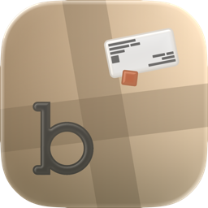
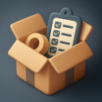
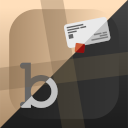
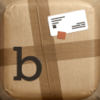
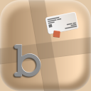
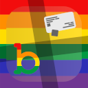

  

<h1 align="center">BoxHelper</h1>

  Organize boxes, items, and storage locations with photos, QR codes, backups, CSV import/export, and Shortcuts automation.

  <a href="https://apps.apple.com/us/app/boxhelper/id6737223705">View on the App Store</a>

  
  
  

## Overview

BoxHelper is a SwiftUI app for keeping track of boxes, items, and storage locations. It is built for moving, home storage, basement shelves, office inventory, storage units, or any setup where you want to know what you own, where it is, and how to find it again without opening every box.

Each box can get its own QR code. Scan the code later to jump directly to the box and see what is inside. BoxHelper also supports photos, tags, deeper search, backups, CSV import/export, and automation through Siri Shortcuts and App Intents.

## Why This Project Is Open

I no longer want to hide this app away. I want everyone to have the chance to become part of BoxHelper, whether that means actively contributing to this repository, learning from the code, or building their own version from it.

AI has made it easier than ever to create copycats of management and organization apps. Instead of spreading effort across a thousand half-finished clones, I believe it is better to combine resources, ideas, and real-world feedback into one strong app that can become genuinely useful for more people.

## Features

- Manage boxes, items, and locations
- Generate, customize, print, and scan QR codes for boxes
- Add photos to boxes, items, and locations
- Search across boxes, items, locations, tags, and linked content
- Create, export, share, import, merge, and restore ZIP backups
- Import and export CSV files for boxes, items, and locations
- Use Siri Shortcuts and App Intents for recurring workflows
- Customize QR code labels and app appearance
- Keep inventory data under user control on device

## App Icons

  
  
  
  
  

## Platform Support

BoxHelper is built for:

- iPhone with iOS 18.0 or later
- iPad with iPadOS 18.0 or later
- Mac with macOS 15.0 or later and an Apple M1 chip or later
- Apple Vision with visionOS 2.0 or later

## Development

### Requirements

- Xcode
- iOS/iPadOS simulator or a compatible test device
- Local Swift package `Zip`, because the Xcode project references `../../Zip-master`

### Open the Project

1. Clone the repository.
2. Make sure the local `Zip` dependency is available at the expected relative path.
3. Open `BoxHelper.xcodeproj` in Xcode.
4. Select a scheme, for example `en-US`, `de-DE`, or `BoxHelperRelase`.
5. Build and run the app on a simulator or device.

## Privacy

BoxHelper is designed around local organization and user-controlled exports. The app does not collect user data. Backups and CSV files are created, shared, imported, or restored by the user.

## App Store

BoxHelper is available for free in the Productivity category on the App Store. Current public version: `2.0.1`.

[Open BoxHelper on the App Store](https://apps.apple.com/us/app/boxhelper/id6737223705)

## License

BoxHelper is licensed under the GNU Affero General Public License v3.0 (`AGPL-3.0`).

If you build on this project, modify it, or create your own version from it, please make your derived work available to others under the same license. This keeps improvements open, supports the project, and helps the community build one better app together instead of many closed or unfinished copies.

License information for included third-party components is stored in `BoxHelper/Licenses/`.
